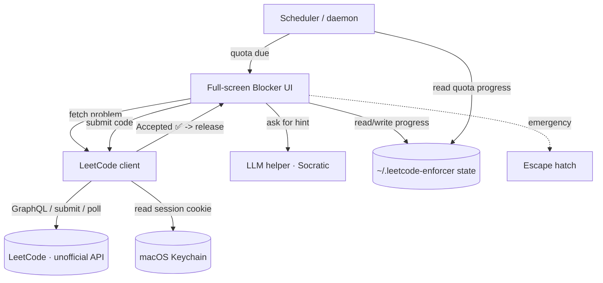

# leetcode-enforcer — Design Doc

> Status: Draft (in progress — designing interactively)
> Last updated: 2026-06-04

## 1. Problem & Goals
A personal forcing-function tool to build a consistent LeetCode practice habit. It
periodically presents a LeetCode problem and **blocks the screen until the problem is
solved** (verified by an actual "Accepted" submission), with a Socratic LLM helper that
teaches rather than spoils. For the author (fights procrastination; nudges alone don't work).

Success = the author actually meets a daily problem quota consistently, and *learns* (not
just copies answers) because the helper only gives hints.

## 2. Non-Goals / Out of Scope
- Not a LeetCode replacement — we submit to and rely on real LeetCode for judging.
- Not multi-user; no accounts/cloud sync.
- The LLM helper must **not** hand over full solutions (hints/concepts only).
- Not a literally un-killable app — there is always a deliberate **emergency escape hatch**.

## 3. Requirements & Constraints
**Functional**
- Fetch a LeetCode problem (respecting difficulty/topic prefs) via LeetCode's unofficial API.
- Present it in a **full-screen, always-on-top blocker** that disables normal quit/close.
- Let the user write a solution, **submit to LeetCode**, and release **only on "Accepted"**.
- **Daily quota** (e.g. 2/day) with escalating nags as the day progresses if behind.
- **Socratic LLM helper**: progressive hints + concept explanations, refuses full solutions.
- **Emergency escape hatch**: a deliberate, slightly-effortful way out for real emergencies.

**Non-functional**
- macOS desktop app; runs in background and triggers on schedule.
- Secure handling of LeetCode session credentials (never committed; stored safely).
- Resilient to the unofficial API breaking (fail gracefully, don't trap the user).

**Constraints**
- macOS only; project `venv` (no global installs) if Python.
- LeetCode has **no official API** — depends on the unofficial GraphQL endpoint + the
  user's `LEETCODE_SESSION` cookie + CSRF token.
- Data/credentials live outside the repo.

**Open decisions (to resolve while designing):**
- LLM backend: local Ollama vs Claude API (leaning Claude for hint quality).
- Enforcement stack: native Swift vs Python — a true screen blocker is easier/robust natively.

## 4. Proposed Architecture
The core of the doc. Work this out down to the details.
- **Components & responsibilities** — the pieces and what each owns. Every box should
  have a one-line *why it exists* (a component earns its place by solving a named problem).
- **Data model & storage** — entities, where/how data lives (add an ERD if non-trivial).
- **How pieces communicate** — APIs, function calls, events, IPC.

### 4a. LeetCode integration (the riskiest piece — designed first)
- **Fetch problem:** `POST https://leetcode.com/graphql` (GraphQL query). Returns title, slug,
  number (`questionFrontendId`), difficulty, topic tags, premium flag, and language starter
  snippets — enough for selection, the web link (#13), pattern-matching (#12), and language
  starters (#16).
- **Problem selection (resolved — see #14, #15):** draw only from **curated banks** (Blind 75,
  NeetCode 150, Grind 75, …), not the whole problemset. These lists aren't a LeetCode API feature,
  so the app ships a **bundled mapping** of each list → problem slugs (a small static data file,
  updatable). **Free-tier only:** filter out any problem whose `isPaidOnly` is true. The
  "same-pattern next question" (#12) picks within the same topic tag from the active bank.
- **Submit:** `POST https://leetcode.com/problems/{slug}/submit/` with code + lang + question_id;
  requires `LEETCODE_SESSION` cookie + `X-CSRFToken` header. Returns `submission_id`.
- **Verdict:** poll `.../submissions/detail/{id}/check/` until status resolves; release the
  blocker only on `Accepted`.
- **Auth = manual cookie paste, stored in macOS Keychain.** Decision rationale: simplest and
  most robust (no embedded browser / login scraping); all auth methods hold the same session
  secret anyway, so security comes from *storage*, not capture method. Cookie is a time-boxed
  bearer token (~2-week expiry), scope limited to LeetCode. Keychain (encrypted, OS
  access-controlled) over plaintext; credentials live outside the repo and in `.gitignore`.
  Accepted cost: re-paste the cookie when it expires.
- **Failure handling:** if the API breaks or the cookie is expired/invalid, fail gracefully and
  **do not trap the user** — surface the error and fall back to the escape hatch.

### 4b. Components (single-machine desktop app — no distributed infra needed)
- **Scheduler / daemon** — tracks the daily quota, decides when to trigger a session, drives
  escalating nags. *Why:* the periodic forcing function. (launchd agent or a background loop.)
- **Blocker UI** — full-screen, always-on-top window: shows the problem, a code editor, Submit,
  the hints panel, and the escape hatch. *Why:* the enforcement surface = the product.
- **LeetCode client** — fetch problem (GraphQL), submit, poll verdict; uses the Keychain cookie.
  *Why:* the only thing that can authoritatively say "solved."
- **LLM helper** — Socratic hints/concepts, refuses full solutions. *Why:* teach without spoiling.
- **State store** — quota progress, solved-history log, prefs in `~/.leetcode-enforcer/`;
  session cookie in **Keychain**. *Why:* persistence + secure credential storage.
- **Escape hatch** — a deliberate, slightly-effortful exit. *Why:* safety; never trap the user.

### 4c. Key flow (sequence)
1. Scheduler sees quota unmet → launches Blocker. 2. Blocker asks LeetCode client for a problem
→ renders it full-screen. 3. User writes code; may request progressive hints from the LLM helper.
4. User submits → client submits to LeetCode → polls verdict. 5. `Accepted` → record progress in
state, release the blocker. Anything else → stay blocked, show the verdict. 6. Real emergency →
escape hatch logs the bypass and exits.

## 5. Stack Choice + Why
- **Phase 1 — Python prototype** (pywebview for the blocker UI, `urllib`/`requests` for LeetCode,
  `keyring` for Keychain). *Why:* fastest path to validate the habit loop (fetch → block → submit
  → release + hints); reuses memento patterns. Honest limit: the Python blocker is **best-effort**
  — always-on-top full-screen, but escapable via cmd-tab/force-quit. Acceptable for validating the
  *idea*, not for real enforcement.
- **Phase 2 — Swift rewrite** (AppKit kiosk-style window at screen-saver level, disable cmd-Q,
  hide Dock/menu bar). *Why:* the real deployment target; only native gives robust enforcement +
  a signed `.app`. Earned only if the prototype proves the habit sticks.
- **LLM backend:** local **Ollama (qwen)** — private, free, offline; reuses memento's setup
  (`qwen3:8b` at `http://localhost:11434/v1`, OpenAI-compatible HTTP). Sits behind an `LLM helper`
  interface so it can be swapped later if hint quality proves insufficient.

## 6. Alternatives Considered + Why Rejected
- **WebView / headless-browser auth** — rejected: same session secret as cookie-paste but more
  code and more fragility; cookie-paste + Keychain is simpler and equally secure.
- **Native Swift from day one** — deferred: don't want to learn Swift *and* validate the idea at
  once; prototype-first de-risks before the rewrite investment.
- **Local test-case runner instead of LeetCode submit** — rejected: user wants authentic
  "Accepted" judging; a local sandbox per language is more work and less trustworthy.
- **Truly un-killable app** — rejected on safety; always keep an escape hatch.

## 7. Failure Modes / Risks
- **Unofficial API breaks / changes** — fetch or submit starts failing. Handle: detect errors,
  show a clear message, fall back to escape hatch; never leave the user trapped.
- **Cookie expired/invalid** — submit returns 401/403. Handle: prompt to re-paste, don't block.
- **Weak prototype blocker** — Python window is escapable (known/accepted for Phase 1).
- **Credential leak** — mitigated by Keychain storage + `.gitignore` + outside-repo data.
- **LLM spoils the answer** — mitigated by a system prompt constrained to hints; still imperfect.
- **Lockout in an emergency** — the escape hatch is the explicit mitigation; must always work
  even if LeetCode/LLM are down.
- **Rate limiting / anti-bot** from LeetCode on frequent submits — keep cadence human, back off.

## 8. Rollout / Deploy Plan
- **Phase 1 (prototype):** run locally via project `venv`; trigger via a launchd agent or manual
  run. Validate the loop + that the habit sticks. CI/test gate optional here per workflow.
- **Phase 2 (product):** if validated → Swift rewrite, signed `.app`, launch-at-login, real
  enforcement, proper test suite + CI gate. Name the moment it becomes a product.

## 9. Open Questions
- ~~Escape-hatch design~~ — RESOLVED (#6): a **tiered "I can't solve this" flow**, options in order:
  1. **Downshift** — solve ≥3 *previously solved* problems instead (or 3 Easy ones if no history);
     clearing them releases the user. (UI loop needs the state store/scheduler → follow-up #22.)
  2. **Give up** (last resort) — type "I GIVE UP"; releases now but the app **re-triggers after a
     1-hour cooldown** (follow-up #23). Every give-up is logged to `~/.leetcode-enforcer/escapes.log`.
  Policy logic (phrase check, fallback selection, give-up + cooldown) lands in #6; the alternate-
  problem UI loop and the 1h re-trigger integrate in #22/#23 once #8/#9 exist.
- ~~Problem selection~~ — RESOLVED (#14/#15): curated banks (Blind 75/NeetCode 150/…), free-tier
  only, via a bundled list→slug mapping. Still open: which bank(s) to ship first, and how/when to
  refresh the bundled mapping.
- Quota: fixed at 2/day, or configurable? What resets it (midnight local)?
- How aggressive should "escalating nags" get, and via what (notification, refocus, full block)?
